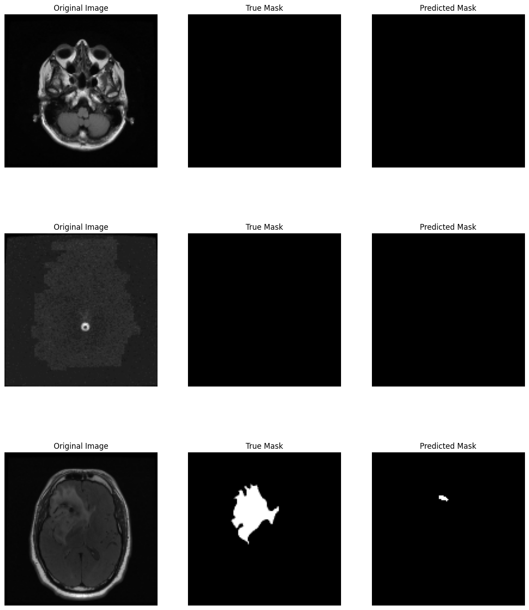

## `README.md`

Copy all the text inside the box below into your `README.md` file.

```markdown
# Brain Tumor Segmentation using U-Net in TensorFlow

This project is an end-to-end implementation of a deep learning model to perform semantic segmentation on brain MRI scans. The model uses the U-Net architecture to identify and outline tumor regions from the input images.

## 🚀 Project Demo

The model is trained to take an MRI scan as input and output a binary mask highlighting the predicted tumor area. The model successfully identifies both healthy tissue and tumorous regions in data it has never seen before.



## 🛠️ Tech Stack

* **TensorFlow & Keras**: For building and training the U-Net model.
* **OpenCV**: For image loading and processing.
* **Scikit-learn**: For splitting the dataset.
* **NumPy**: For numerical operations.
* **Matplotlib**: For data visualization.
* **Tqdm**: For displaying progress bars.

## 📂 Project Structure

The project is organized with a clear and reproducible structure.

```

brain-tumor-segmentation/
├── data/                  \# To be populated with the dataset from Kaggle
├── models/
│   └── best\_brain\_tumor\_model.keras
├── notebooks/
│   └── 01-data-exploration.ipynb
├── requirements.txt       \# Project dependencies
└── README.md

````

## ⚙️ Setup and Installation

To run this project locally, follow these steps:

**1. Clone the repository:**
```bash
git clone [https://github.com/](https://github.com/)[your-username]/brain-tumor-segmentation.git
cd brain-tumor-segmentation
````

**2. Download the Dataset:**

  * Download the dataset from [Kaggle: Brain MRI Segmentation](https://www.kaggle.com/datasets/mateuszbuda/lgg-mri-segmentation).
  * Unzip the contents into the `data/` directory.

**3. Create and Activate a Virtual Environment:**

```bash
# Create the environment
python -m venv .venv

# Activate on Windows
.venv\Scripts\activate

# Activate on macOS/Linux
source .venv/bin/activate
```

**4. Install Dependencies:**

```bash
pip install -r requirements.txt
```

## 📖 Usage

The entire workflow, from data loading and preprocessing to model training and evaluation, is contained in the Jupyter Notebook:
`notebooks/01-data-exploration.ipynb`

Simply open and run the cells in the notebook to replicate the project.

## 📈 Results

The model was trained for 25 epochs and demonstrated excellent performance with no significant overfitting. The training and validation loss curves converged steadily, indicating a stable learning process.

The model performs well on unseen test data, successfully identifying both healthy tissue and the location of tumors, although it shows a tendency to under-segment larger tumor areas, which can be addressed with future improvements.

## 🔮 Future Improvements

While the model performs well, there are several areas for future improvement:

  * **Implement Dice Loss:** Use a Dice Loss function instead of Binary Cross-Entropy. This loss function is better suited for segmentation tasks with class imbalance and can help improve the precision of the predicted masks.
  * **Data Augmentation:** Apply random transformations (rotation, flipping, zooming) to the training data to create more variety and make the model more robust.
  * **Hyperparameter Tuning:** Experiment with different learning rates, batch sizes, and optimizer settings to further refine performance.

## 📄 License

This project is licensed under the MIT License.

````

---
## `requirements.txt`

Create a file named `requirements.txt` in your main project folder and copy the text below into it.

```text
tensorflow
scikit-learn
opencv-python
matplotlib
numpy
tqdm
````